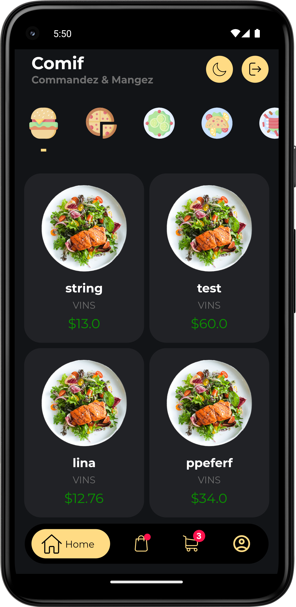

# Food Delivery App

## Table of contents
- [Introduction](#introduction)
- [Features](#features)
- [Prerequisites](#prerequisites)
- [Getting Started](#getting-started)
- [Folder Structure](#folder-structure)
- [Backend](#backend)
- [License](#license)

## Introduction
Food delivery app is a simple mobile app that allows it's user to choose between different products and make an order. The order is registered in an external database.

## Features

- User sessions
Each user has it's own unique account.
<p align="center">
  
  
  
</p>

- Choose between different products and fill up their chart
<p align="center">
  
  
  
</p>

- Change between dark and light mode
<p align="center">
  
  
</p>

## Prerequisites
- [Flutter](https://flutter.dev/docs/get-started/install)
- [Python](https://www.python.org/downloads/) for the backend
    - To install all libraries
  ```
  pip install -r app_backend/requirements.txt
  ```

## Getting started
Step-by-step instructions to install and run the app : 
1. Clone the repository:
    ```bash
    git clone https://github.com/adam2305/Food-Order-App.git
    ```
2. Run the backend:
    ```bash
    cd app_backed
    uvicorn main:app --host 0.0.0.0 --port 8000
    ```
3. Run the backend:
    ```bash
    cd app_frontend
    flutter pub get
    flutter run
    ```

## Project Structure
The front end of this mobile app (app_frontend folder) is entirely written in Flutter.
All the data is retrieved from a custom backend API.

The backend is a custom API allowing the app to interact with a database. The REST Api is written in 
python using the FastAPI framework.

## Backend
To access more detailed data on the API you can access the documentation:
``bash
   http://120.0.0.1:8000/docs
   http://120.0.0.1:8000/redoc
   
    ```


